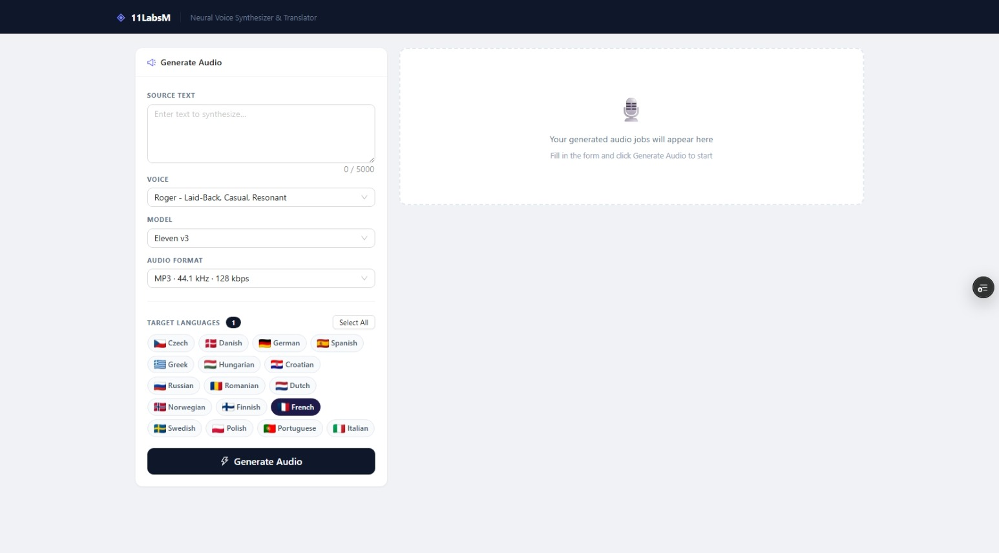

# 11LabsM - Neural Voice Synthesizer & Translator


A full-stack web application that translates text into multiple languages simultaneously and generates high-quality text-to-speech audio for each using the [ElevenLabs](https://elevenlabs.io/) API. Jobs are processed asynchronously in the background; the UI polls for progress and lets users play previews or download a ZIP of all generated audio files.

---

## 📸 Preview

**Hero**


---

## Table of Contents

- [Features](#features)
- [Architecture Overview](#architecture-overview)
- [Tech Stack](#tech-stack)
- [Project Structure](#project-structure)
- [How It Works](#how-it-works)
- [Supported Languages & Audio Formats](#supported-languages--audio-formats)
- [API Reference](#api-reference)
- [Environment Variables](#environment-variables)
- [Local Development](#local-development)
- [Docker (Full Stack)](#docker-full-stack)
- [Deployment](#deployment)
- [Caching Strategy](#caching-strategy)

---

## Features

- **Multi-language TTS** - Submit text once and generate speech in up to 17 languages in parallel.
- **Translation providers** - DeepL, Google Translate, or MyMemory (free, no API key required).
- **ElevenLabs voices** - Pick any voice from your ElevenLabs account; voices are fetched live.
- **Audio format selection** - MP3 (128 / 192 kbps) or PCM (22.05 / 44.1 kHz).
- **Real-time progress** - UI polls the backend every 3 seconds and shows per-language status.
- **In-browser audio preview** - Animated waveform player streams audio directly from the backend.
- **ZIP download** - Download all completed audio files in one click.
- **Smart caching** - Identical (text + language + voice + format) combinations are cached for 7 days, skipping redundant ElevenLabs API calls.
- **Retry logic** - Exponential back-off on ElevenLabs rate limits and network errors (up to 5 retries).

---

## Architecture Overview

```
┌──────────────────────────────────────────┐
│              Vercel (Frontend)           │
│  React + TypeScript + Ant Design + Vite  │
│                                          │
│  ┌──────────┐      ┌─────────────────┐   │
│  │ JobForm  │───▶ │   API Client     │  │
│  └──────────┘      │  /api/* proxy    │  │
│  ┌──────────┐◀─── │   (Vercel rewrite│  │
│  │JobStatus │      │   → Render.com)  │  │
│  └──────────┘      └─────────────────┘   │
└─────────────────────────┬────────────────┘
                          │ HTTP
┌─────────────────────────▼────────────────┐
│           Render.com (Backend)           │
│                                          │
│  ┌──────────────────────────────────┐    │
│  │   FastAPI  (uvicorn)  :8000      │    │
│  │   POST /jobs/create              │    │
│  │   GET  /jobs/{id}                │    │
│  │   GET  /jobs/{id}/download       │    │
│  │   GET  /jobs/{id}/files/{lang}/  │    │
│  │          stream                  │    │
│  │   GET  /voices/                  │    │
│  └──────────┬───────────────────────┘    │
│             │ enqueue tasks              │
│  ┌──────────▼───────────────────────┐    │
│  │   Celery Worker (4 concurrency)  │    │
│  │   1. translate_sync()            │    │
│  │   2. cache check (Redis)         │    │
│  │   3. generate_audio_sync()       │    │
│  │      → ElevenLabs API            │    │
│  │   4. upload_audio() → Redis      │    │
│  └──────────┬───────────────────────┘    │
│             │                            │
│  ┌──────────▼───────────────────────┐    │
│  │   Redis                          │    │
│  │   • Job & audio-file state       │    │
│  │   • Audio bytes (base64, 24 h)   │    │
│  │   • TTS cache keys (7 days)      │    │
│  │   • Celery broker & result store │    │
│  └──────────────────────────────────┘    │
└──────────────────────────────────────────┘
```

---

## Tech Stack

| Layer | Technology |
|---|---|
| **Frontend** | React 18, TypeScript, Vite 5, Ant Design 6 |
| **Backend** | Python 3.11+, FastAPI 0.111, Uvicorn |
| **Task queue** | Celery 5.3 |
| **State & storage** | Redis (jobs, audio bytes, cache, broker) |
| **TTS** | ElevenLabs REST API (`eleven_multilingual_v2`) |
| **Translation** | DeepL / Google Translate / MyMemory |
| **HTTP client** | httpx (async + sync), tenacity (retries) |
| **Frontend deploy** | Vercel |
| **Backend deploy** | Render.com (Docker) |

---

## Project Structure

```
.
├── render.yaml                  # Render.com deployment config (API, worker, Redis)
├── test_api.sh                  # Shell script for manual API testing
│
├── frontend/                    # React SPA
│   ├── src/
│   │   ├── App.tsx              # Root layout (two-column: form | job status)
│   │   ├── api/client.ts        # Typed fetch wrappers for all backend endpoints
│   │   ├── components/
│   │   │   ├── JobForm.tsx      # Text input, voice/language/format selection
│   │   │   └── JobStatus.tsx    # Per-language progress, waveform player, download
│   │   └── types/index.ts       # Shared TypeScript types (Job, AudioFile, Voice…)
│   ├── vite.config.ts           # Dev proxy: /api/* → localhost:8000
│   └── vercel.json              # Production rewrites: /api/* → Render backend URL
│
└── tts_backend/                 # Python backend
    ├── app/
    │   ├── main.py              # FastAPI app, CORS, routers, lifespan
    │   ├── config.py            # Pydantic-settings (env vars, lru_cache)
    │   ├── api/
    │   │   ├── jobs.py          # /jobs/* endpoints (create, status, download, stream)
    │   │   └── voices.py        # GET /voices/
    │   ├── services/
    │   │   ├── tts.py           # ElevenLabs API calls (async + sync) with retries
    │   │   └── translation.py   # DeepL / Google / MyMemory translation
    │   ├── workers/
    │   │   ├── celery_app.py    # Celery app configuration
    │   │   └── tts_tasks.py     # Main Celery task: translate → TTS → store
    │   ├── storage/
    │   │   └── audio_store.py   # Upload/download audio bytes in Redis
    │   └── utils/
    │       ├── cache.py         # SHA-256 content-addressed TTS cache in Redis
    │       ├── database.py      # (legacy, unused in current Redis-only mode)
    │       └── redis_store.py   # Job & audio-file CRUD on Redis
    ├── docker-compose.yml       # Local full-stack (API + worker + Redis + PostgreSQL + MinIO)
    ├── Dockerfile
    └── requirements.txt
```

---

## How It Works

### End-to-end job flow

```
User fills form → POST /jobs/create
  └─ FastAPI creates job record + per-language audio-file records in Redis
  └─ Dispatches one Celery task per language (fire-and-forget)
  └─ Returns { job_id, status: "processing" } immediately (HTTP 202)

Celery task (per language):
  1. Mark audio-file status → "generating"
  2. Translate source text via configured provider (or return as-is if lang=en)
  3. Check TTS cache (Redis SHA-256 key) — skip ElevenLabs if already generated
  4. Call ElevenLabs /text-to-speech/{voice_id}
  5. Store audio bytes in Redis (base64-encoded, 24 h TTL)
  6. Update audio-file status → "complete" with file key
  7. Check if all sibling files are done → set job status to "ready" / "partial" / "failed"

Frontend polls GET /jobs/{id} every 3 s:
  └─ Renders per-language status cards (pending / generating / complete / failed)
  └─ Stops polling when job status is ready | partial | failed

User clicks Play:
  └─ Browser fetches GET /jobs/{id}/files/{lang}/stream
  └─ FastAPI reads bytes from Redis → streams as audio/mpeg

User clicks Download ZIP:
  └─ Browser fetches GET /jobs/{id}/download
  └─ FastAPI reads all complete audio files from Redis → streams a ZIP
```

---

## Supported Languages & Audio Formats

### Languages (17)

| Code | Language | Code | Language |
|---|---|---|---|
| `cs` | Czech | `nl` | Dutch |
| `da` | Danish | `no` | Norwegian |
| `de` | German | `fi` | Finnish |
| `es` | Spanish | `fr` | French |
| `gr` | Greek | `sv` | Swedish |
| `hu` | Hungarian | `pl` | Polish |
| `hr` | Croatian | `pt` | Portuguese |
| `ru` | Russian | `it` | Italian |
| `ro` | Romanian | | |

### Audio Formats

| Value | Description |
|---|---|
| `mp3_44100_128` | MP3 · 44.1 kHz · 128 kbps (default) |
| `mp3_44100_192` | MP3 · 44.1 kHz · 192 kbps |
| `pcm_22050` | PCM · 22.05 kHz (WAV-compatible) |
| `pcm_44100` | PCM · 44.1 kHz (WAV-compatible) |

---

## API Reference

### `POST /jobs/create`
Create a new multi-language TTS job.

**Request body:**
```json
{
  "text": "Hello, world!",
  "languages": ["fr", "de", "es"],
  "voice_id": "21m00Tcm4TlvDq8ikWAM",
  "audio_format": "mp3_44100_128"
}
```

**Response `202 Accepted`:**
```json
{ "job_id": "<uuid>", "status": "processing" }
```

---

### `GET /jobs/{job_id}`
Poll job and per-language audio file status.

**Response:**
```json
{
  "id": "<uuid>",
  "status": "processing",
  "voice_id": "...",
  "audio_format": "mp3_44100_128",
  "created_at": "2024-01-01T00:00:00Z",
  "updated_at": "2024-01-01T00:00:05Z",
  "audio_files": [
    {
      "id": "<uuid>",
      "language": "fr",
      "status": "complete",
      "file_url": "<redis-key>",
      "error_message": null,
      ...
    }
  ]
}
```

Job statuses: `processing` → `ready` | `partial` | `failed`  
Audio file statuses: `pending` → `generating` → `complete` | `failed`

---

### `GET /jobs/{job_id}/files/{language}/stream`
Stream audio for a single completed language file directly to the browser.

---

### `GET /jobs/{job_id}/download`
Stream a ZIP archive containing all completed audio files.  
Filename format: `{language}_{voice_id}.{ext}`

---

### `GET /voices/`
List all ElevenLabs voices available for the configured API key.

---

### `GET /health`
Health check — returns `{ "status": "ok", "version": "1.0.0" }`.

---

## Environment Variables

Copy `.env.example` to `.env` and populate the required values.

| Variable | Required | Default | Description |
|---|---|---|---|
| `ELEVENLABS_API_KEY` | **Yes** | — | ElevenLabs secret key |
| `ELEVENLABS_MODEL` | No | `eleven_multilingual_v2` | TTS model ID |
| `TRANSLATION_PROVIDER` | No | `deepl` | `deepl` / `google` / `mymemory` |
| `DEEPL_API_KEY` | If using DeepL | — | DeepL API key |
| `GOOGLE_TRANSLATE_API_KEY` | If using Google | — | Google Translate API key |
| `REDIS_URL` | No | `redis://localhost:6379/0` | Redis connection string |
| `CORS_ORIGINS` | No | `http://localhost:3000,...` | Comma-separated allowed origins |
| `APP_ENV` | No | `production` | `production` or `development` |
| `SECRET_KEY` | No | `changeme` | App secret (change in production) |
| `MAX_TEXT_LENGTH` | No | `5000` | Maximum characters per request |
| `MAX_LANGUAGES_PER_JOB` | No | `20` | Maximum languages per job |

> **Note:** `mymemory` requires no API key and works out of the box, but has rate limits (~5000 chars/day on the free tier). It is the default provider on Render.

---

## Local Development

### Prerequisites
- Python 3.11+
- Node.js 18+
- Docker & Docker Compose (for Redis)

### Backend

```bash
cd tts_backend

# 1. Create virtual environment
python -m venv venv
source venv/bin/activate   # Windows: venv\Scripts\activate

# 2. Install dependencies
pip install -r requirements.txt

# 3. Start Redis (and optionally PostgreSQL/MinIO)
docker compose up redis -d

# 4. Configure environment
cp .env.example .env
# Edit .env — set ELEVENLABS_API_KEY at minimum

# 5. Start the API server
uvicorn app.main:app --reload
# → http://localhost:8000
# → http://localhost:8000/docs  (Swagger UI)

# 6. Start the Celery worker (separate terminal)
celery -A app.workers.celery_app worker --loglevel=info --concurrency=4
```

### Frontend

```bash
cd frontend

# 1. Install dependencies
npm install

# 2. Start the dev server (proxies /api/* → localhost:8000)
npm run dev
# → http://localhost:3000

# 3. Build for production
npm run build
```

---

## Docker (Full Stack)

Spin up the entire backend stack (API + worker + Redis + PostgreSQL + MinIO) with one command:

```bash
cd tts_backend
cp .env.example .env   # set ELEVENLABS_API_KEY

docker compose up --build
```

| Service | URL |
|---|---|
| API | http://localhost:8000 |
| Swagger docs | http://localhost:8000/docs |
| MinIO console | http://localhost:9001 (minioadmin / minioadmin) |

---

## Deployment

### Backend → Render.com

The `render.yaml` at the project root defines three Render services:

| Service | Type | Description |
|---|---|---|
| `tts-redis` | Redis | Managed Redis instance (free plan) |
| `tts-api` | Web (Docker) | FastAPI server, health check `/health` |
| `tts-worker` | Worker (Docker) | Celery worker, 4 concurrent processes |

**Steps:**
1. Push the repo to GitHub.
2. In the [Render dashboard](https://render.com), create a new **Blueprint** from the repo root.
3. Set the `ELEVENLABS_API_KEY` secret in the Render dashboard (it is marked `sync: false` in `render.yaml`).
4. Render auto-links `REDIS_URL` from the managed Redis instance.

### Frontend → Vercel

`frontend/vercel.json` rewrites `/api/*` to the Render backend URL (`https://one1labsm.onrender.com`).

**Steps:**
1. Import the `frontend/` folder (or the whole repo with root set to `frontend/`) into [Vercel](https://vercel.com).
2. No extra environment variables are required — the rewrite rule handles routing to the backend.
3. Vercel auto-deploys on every push to `main`.

---

## Caching Strategy

The backend uses a two-layer caching approach entirely within Redis:

| Layer | Key | TTL | Purpose |
|---|---|---|---|
| **TTS cache** | `tts_cache:{sha256(text\|lang\|voice\|format)}` | 7 days | Skip ElevenLabs API call for duplicate combinations |
| **Audio data** | `audio_data:{job_id}/{lang}_{voice}.{ext}` | 24 hours | Store raw audio bytes (base64) for streaming/download |
| **Job state** | `job:{job_id}` / `audio:{af_id}` | 24 hours | Track job and per-language processing status |

The TTS cache is especially valuable when users repeatedly synthesize the same phrases (e.g., a company tagline) — the audio is served instantly from Redis without hitting the ElevenLabs API or consuming quota.
